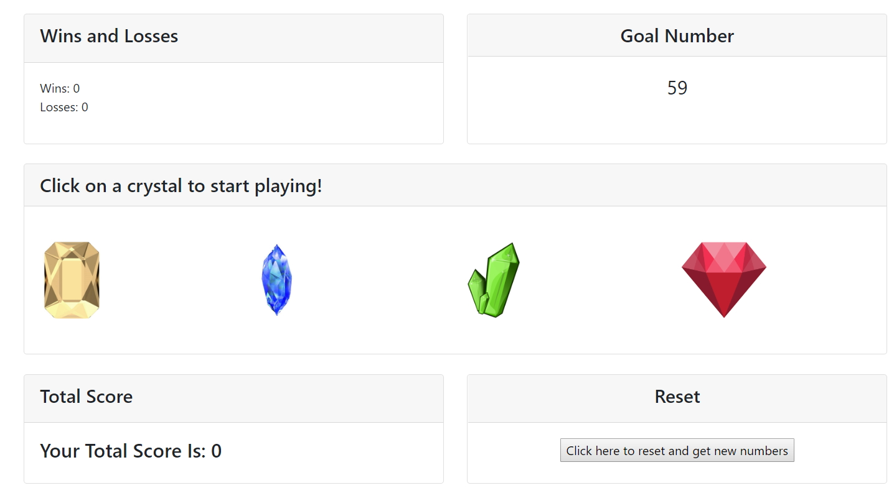

# Crystals-Collector

In this browser-based JavaScript and jQuery powered game, the player is given a random number and four crystals to click on. By clicking on each crystal the player adds a specific amount of points to the total score. The value of each crystal is generated randomly and hidden until it is clicked and is added to the total score. The player wins by matching his or her total score to the random number given at the beginning and loses if the total score goes above this random number. Each time the game starts or is reset, the value of each crystal will change and a new random goal number will be given.

Screenshot:

